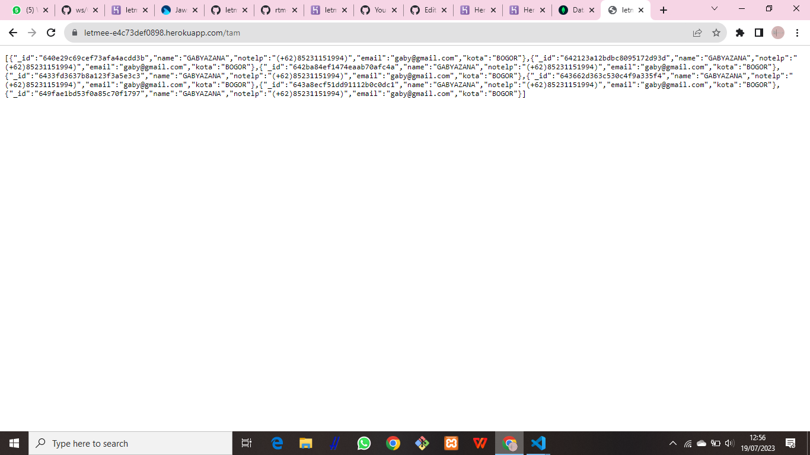
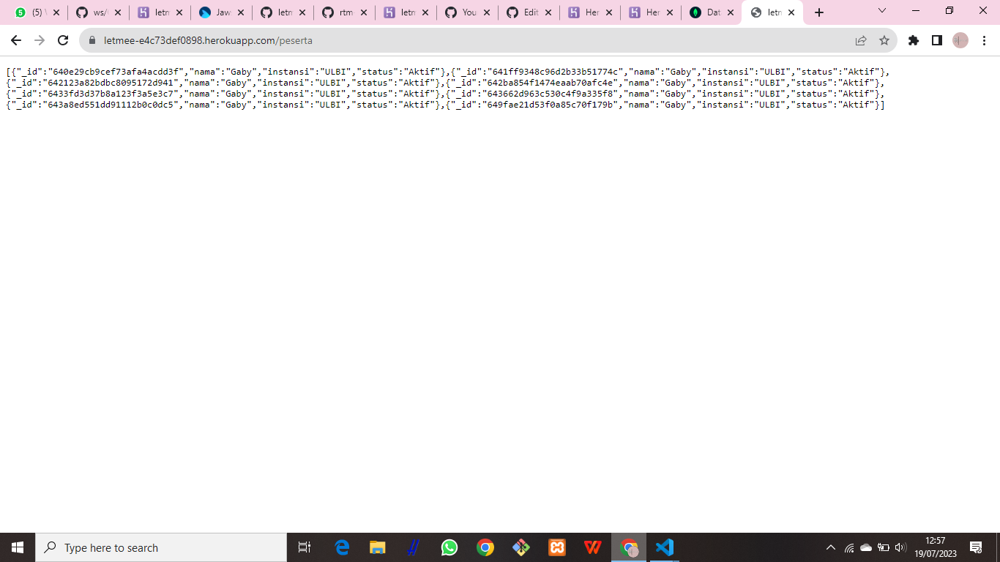
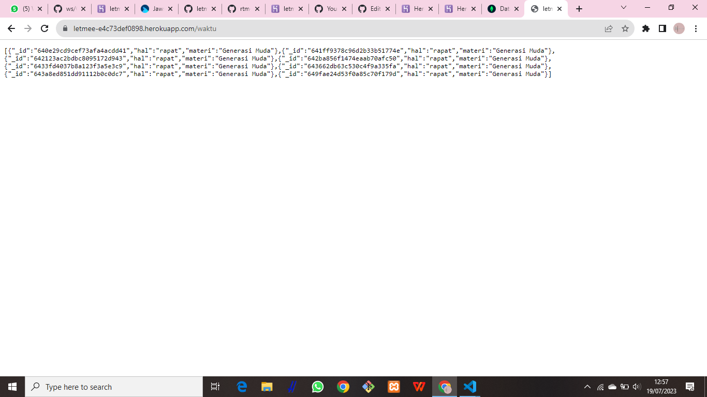

Chapter04 - Deployment aplikasi backend

URL Heroku : https://letmee-e4c73def0898.herokuapp.com/

1. URL 1 https://letmee-e4c73def0898.herokuapp.com/undangan
   
2. URL 2 https://letmee-e4c73def0898.herokuapp.com/tam
   

3. URL 3 https://letmee-e4c73def0898.herokuapp.com/peserta
   

4. URL 4 https://letmee-e4c73def0898.herokuapp.com/waktu
   

MONGODB

1. Undangan (undangan rapat)
   
2. Tam (listtamu)
   
3. Peserta (peserta rapat)
   
4. Waktu (waktu rapat)
   

PACKAGE PKG.DEV

FRONTEND gocroot/app
URL https://gocroot.github.io/app/administrasi/undangan_rapat/template/dashboard.html

